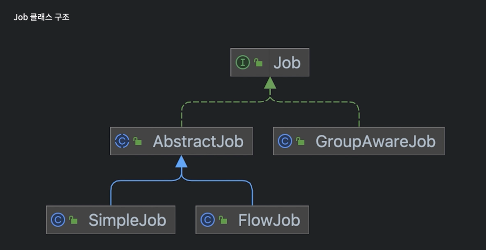
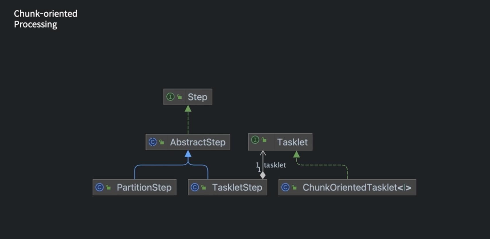

# spring-batch-study

# spring batch 도메인 용어 익히기
- Job
- JobInstance
- JobParameter
- JobExecution
- step
- stepExecution
- ExecutionContext
- JobLauncher
- itemReader/Processor/Writer

# Job 이란?
 - 전체 배치 프로세스를 캡슐화 한 도메인
 - 단순히 Step 인스턴스를 위한 컨테이너

# job의 구성
 - Job의 이름
 - Step 정의 및 순서
 - 작업을 다시 시작할 수 있는지 여부

# Job 클래스의 구조

# Chunk-oriented Processing 구조

